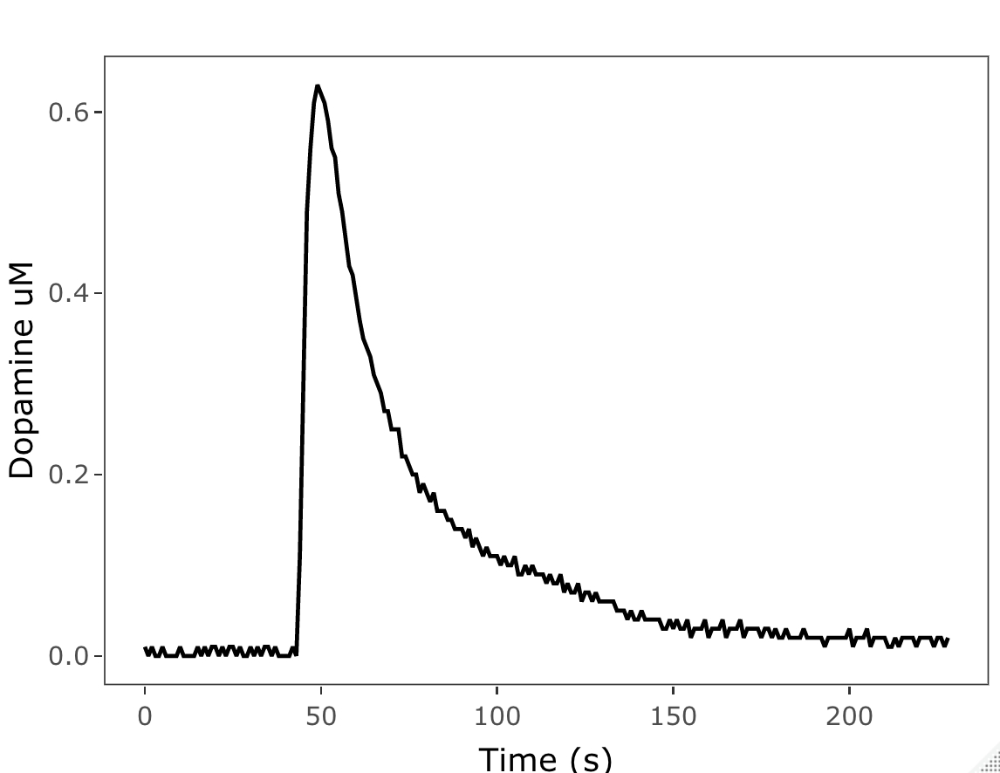

# Purpose of script
This script takes chrono data and prepares it for:
1. visualization 

2. analysis
3. records max amplitude and area under the cure

## NOTE
- Before using this script make sure you have the following packages: tidyverse, filesstrings, plotly, Bolstad2, broom.
- If you do not have the packages, install them by copying and pasting the following command into the console:
- install.packages(c('tidyverse', 'filesstrings', 'plotly', 'Bolstad2', 'broom'))
